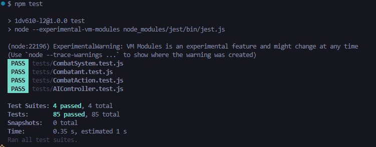

# Test Report - Simple Combat Engine

## Test Run Summary

- Date: 2025-11-10
- Command: npm test
- Node version: 24.1.0
- Jest version: 30.1.2
- Test suites: 4
- Passed: 4
- Failed: 0
- Total tests: 85
- Passed: 85
- Failed: 0

## Tests location

Tests are located in the tests folder

## How to run

- Make sure you have node.js and jest installed
- Run the tests using npm test or npm test -- --verbose for a more detailed output

## Example Terminal Output



### Verbose Terminal Output

```
PASS tests/Combatant.test.js
√ Combatant is created with valid unit object (2 ms)
√ Combatant defaults currentHealth to maxHealth if not provided (1 ms)
√ Combatant throws error if unit is not provided (2 ms)
√ Combatant throws error if id is missing
√ Combatant throws error if name is invalid (1 ms)
√ Combatant throws error if team is missing
√ Combatant throws error if maxHealth is invalid (1 ms)
√ Combatant throws error if attackPower is invalid
√ Combatant throws error if defense is invalid (1 ms)
√ Combatant allows defense to be zero
√ Combatant throws error if speed is invalid (1 ms)
√ takeDamage reduces currentHealth by damage amount
√ takeDamage keeps combatant alive if health remains above zero
√ takeDamage handles multiple damage instances
√ takeDamage reduces damage by 50% when defending (1 ms)
√ takeDamage floors the damage reduction when defending
√ takeDamage does not reduce damage when not defending
√ takeDamage enforces minimum 1 damage when defending
√ takeDamage sets isAlive to false when health reaches zero
√ takeDamage sets isAlive to false when health goes below zero (1 ms)
√ takeDamage allows combatant to remain dead after multiple calls
√ takeDamage throws error for invalid amount types (1 ms)
√ takeDamage throws error for zero or negative amounts

PASS tests/CombatSystem.test.js
√ startCombat initializes combat with valid participants (2 ms)
√ startCombat sets turn order based on speed
√ startCombat throws error if participants is not an array (2 ms)
√ startCombat throws error if participants array is empty (1 ms)
√ executeAttack returns damage dealt on successful hit
√ executeAttack reduces target health
√ executeAttack logs attack message (1 ms)
√ executeAttack returns 0 on miss
√ executeAttack logs miss message when attack misses
√ executeAttack logs defeat message when target dies (1 ms)
√ executeAttack deals minimum 1 damage
√ executeAttack throws error if target not found
√ executeAttack throws error if attacker is dead
√ executeAttack throws error if target is already dead (1 ms)
√ executeDefend sets combatant to defending
√ executeDefend returns true on success
√ executeDefend logs defend message
√ executeDefend reduces damage on next attack
√ executeDefend throws error if combatant not found (1 ms)
√ executeDefend throws error if combatant is dead
√ nextUnitTurn returns next alive combatant
√ nextUnitTurn wraps around to first combatant
√ nextUnitTurn skips dead combatants
√ nextUnitTurn resets defending state for next combatant
√ checkBattleEnd returns false when multiple teams alive
√ checkBattleEnd returns true when one team remains
√ checkBattleEnd sets winner when battle ends
√ checkBattleEnd sets isActive to false when battle ends (1 ms)
√ checkBattleEnd sets winner to none when all dead
√ getState returns current combat state
√ getState returns copy of combatants array
√ getCombatLog returns array of log messages (1 ms)
√ Full combat simulation from start to end
√ Combat handles defending correctly throughout battle

PASS tests/CombatAction.test.js
√ CombatAction is created with valid action object (1 ms)
√ CombatAction accepts accuracy of 0
√ CombatAction accepts accuracy of 1
√ CombatAction accepts accuracy between 0 and 1
√ CombatAction throws error if action is not provided (2 ms)
√ CombatAction throws error if action is not an object (1 ms)
√ CombatAction throws error if name is missing
√ CombatAction throws error if name is not a string (1 ms)
√ CombatAction throws error if name is empty string
√ CombatAction throws error if accuracy is missing
√ CombatAction throws error if accuracy is not a number
√ CombatAction throws error if accuracy is NaN
√ CombatAction throws error if accuracy is less than 0
√ CombatAction throws error if accuracy is greater than 1

PASS tests/AIController.test.js
√ AIController is created with valid combatSystem and actions (1 ms)
√ AIController throws error if combatSystem is not provided (2 ms)
√ AIController throws error if actions is not provided
√ AIController throws error if actions is not an array (1 ms)
√ AIController throws error if actions array is empty
√ chooseAction returns action and target for valid combatant
√ chooseAction selects first action from actions array (1 ms)
√ chooseAction selects first opponent as target
√ chooseAction only targets alive opponents
√ chooseAction only targets opponents from different team
√ chooseAction returns null when no enemies available (1 ms)
√ chooseAction throws error if combatant is not provided
√ AIController decision contains correct structure (1 ms)
√ AIController integrates with CombatSystem correctly

Test Suites: 4 passed, 4 total
Tests: 85 passed, 85 total
Snapshots: 0 total
Time: 0.333 s, estimated 1 s
Ran all test suites.
```
